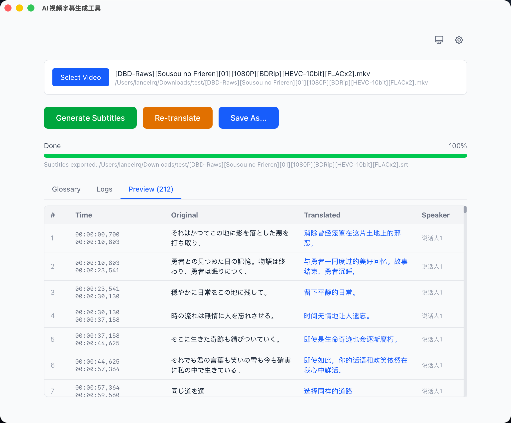

# AI Subtitle Tools

[中文](README.md) | English

A cross-platform desktop tool for automated video subtitle generation and translation. Extracts audio via FFmpeg, performs speech recognition through FunASR API, translates with LLM, and exports bilingual SRT subtitle files.



## Features

- **Speech Recognition** — FunASR API integration, supporting Qwen3-ASR, Paraformer and more
- **Smart Segmentation** — Splits long text by punctuation, greedily merges into proper-length subtitle lines with word-level timestamp alignment
- **Subtitle Translation** — Compatible with OpenAI-format LLM APIs, batch translation, supports reasoning models (auto-filters `<think>` tags)
- **Glossary** — Define `source -> translation` term mappings injected into LLM prompts, ensuring consistent translation of character names, place names, etc.
- **Bilingual Subtitles** — Export original + translated bilingual SRT
- **Multi-language** — Target languages include Chinese, English, Japanese, Korean, Spanish, Portuguese, or custom input
- **Bilingual UI** — Chinese / English interface switching
- **Cross-platform** — Built on Tauri, supports Windows, macOS, Linux
- **Debug Mode** — Save raw ASR JSON and LLM request logs for troubleshooting

## Tech Stack

| Layer | Technology |
|-------|-----------|
| Frontend | Next.js + React + TypeScript + Tailwind CSS |
| Desktop Framework | Tauri 2 (Rust) |
| Speech Recognition | FunASR API |
| Translation | OpenAI-compatible Chat Completions API |
| Audio Processing | FFmpeg |

## Processing Pipeline

```
Video → FFmpeg audio extraction → FunASR speech recognition → Punctuation segmentation & merging → LLM translation (optional) → Export SRT subtitles
```

## Getting Started

### Prerequisites

- [Node.js](https://nodejs.org/) >= 18
- [Rust](https://www.rust-lang.org/tools/install) >= 1.77
- [FFmpeg](https://ffmpeg.org/) (configurable path, auto-detection supported)
- FunASR API service (see [Docker Deployment](#docker-deployment) below)

### Development

```bash
cd app
npm install
npm run tauri dev
```

### Build

```bash
cd app
npm run build
npm run tauri build
```

Build artifacts are located at `app/src-tauri/target/release/bundle/`.

## Docker Deployment

The project provides a Docker Compose configuration to launch FunASR speech recognition and llama.cpp translation services with one command (NVIDIA GPU required):

```bash
cd services

# Start services
./manage.sh start

# Check status
./manage.sh status

# View logs
./manage.sh logs

# Stop services
./manage.sh stop
```

| Service | Port | Description |
|---------|------|-------------|
| FunASR API | 17000 | Speech recognition service, loads Qwen3-ASR 1.7B by default |
| llama.cpp Server | 17001 | LLM translation service, using quantized [translategemma-4b-it](https://huggingface.co/mradermacher/translategemma-4b-it-GGUF) model |

> Download the [translategemma-4b-it-GGUF](https://huggingface.co/mradermacher/translategemma-4b-it-GGUF) model file and place it in the `services/llama_model/` directory before using the llama.cpp service.

## Configuration

App configuration is automatically saved to the system config directory:

- **Windows**: `%APPDATA%/ai-subtitle-tools/config.json`
- **macOS**: `~/Library/Application Support/ai-subtitle-tools/config.json`
- **Linux**: `~/.config/ai-subtitle-tools/config.json`

### Options

| Category | Option | Default | Description |
|----------|--------|---------|-------------|
| FFmpeg | Path | (auto-detect) | If empty, detects in order: user config → local directory → system PATH |
| FunASR | API URL | `http://127.0.0.1:17000` | FunASR service address |
| FunASR | Model | `qwen3-asr-1.7b` | Also available: qwen3-asr-0.6b, paraformer-large |
| LLM | Base URL | `https://api.openai.com/v1` | OpenAI-compatible API endpoint |
| LLM | Model | `gpt-4o-mini` | Any compatible model |
| Translation | Batch Size | 100 | Subtitles per API request (1-200) |
| Translation | Target Language | Chinese | Supports custom input |
| Translation | Glossary | (empty) | One `source -> translation` per line, injected into LLM prompts |
| Subtitle | Max Chars Per Line | 30 | Maximum characters per subtitle line after punctuation splitting |

## Project Structure

```
ai-subtitle-tools/
├── app/                        # Desktop application
│   ├── src/
│   │   ├── app/                # Next.js pages
│   │   ├── components/         # UI components
│   │   │   ├── FilePicker      #   File selection
│   │   │   ├── GlossaryPanel   #   Glossary term mapping
│   │   │   ├── SettingsPanel   #   Settings panel
│   │   │   ├── ProgressBar     #   Progress indicator
│   │   │   └── SubtitlePreview #   Subtitle preview table
│   │   ├── hooks/
│   │   │   └── usePipeline     # Pipeline orchestration
│   │   └── lib/
│   │       ├── ffmpeg          #   FFmpeg execution
│   │       ├── ffmpegDetector  #   3-tier FFmpeg detection
│   │       ├── funasr          #   FunASR API client
│   │       ├── translator      #   LLM translation (retry + batching)
│   │       ├── subtitle        #   SRT parsing/generation
│   │       ├── subtitleSplitter#   Punctuation splitting + greedy merging
│   │       ├── config          #   Configuration management
│   │       ├── debugLog        #   Debug logging
│   │       └── types           #   Type definitions
│   └── src-tauri/              # Tauri Rust backend
│       └── src/
│           ├── lib.rs          #   Entry point + command registration
│           ├── config.rs       #   Config read/write
│           ├── ffmpeg.rs       #   FFmpeg execution + progress events
│           └── file_ops.rs     #   File operations (with security checks)
├── services/                   # Docker service configuration
│   ├── docker-compose.yml
│   └── manage.sh
└── LICENSE                     # MIT
```

## Supported Video Formats

MP4, MKV, AVI, MOV, FLV, WMV, WebM

## Acknowledgements

- [Quantatirsk/funasr-api](https://github.com/Quantatirsk/funasr-api) — A FunASR and Qwen3-ASR based speech recognition API service, supporting 52 languages, compatible with OpenAI API and Alibaba Cloud Speech API.

## License

[MIT](LICENSE)
